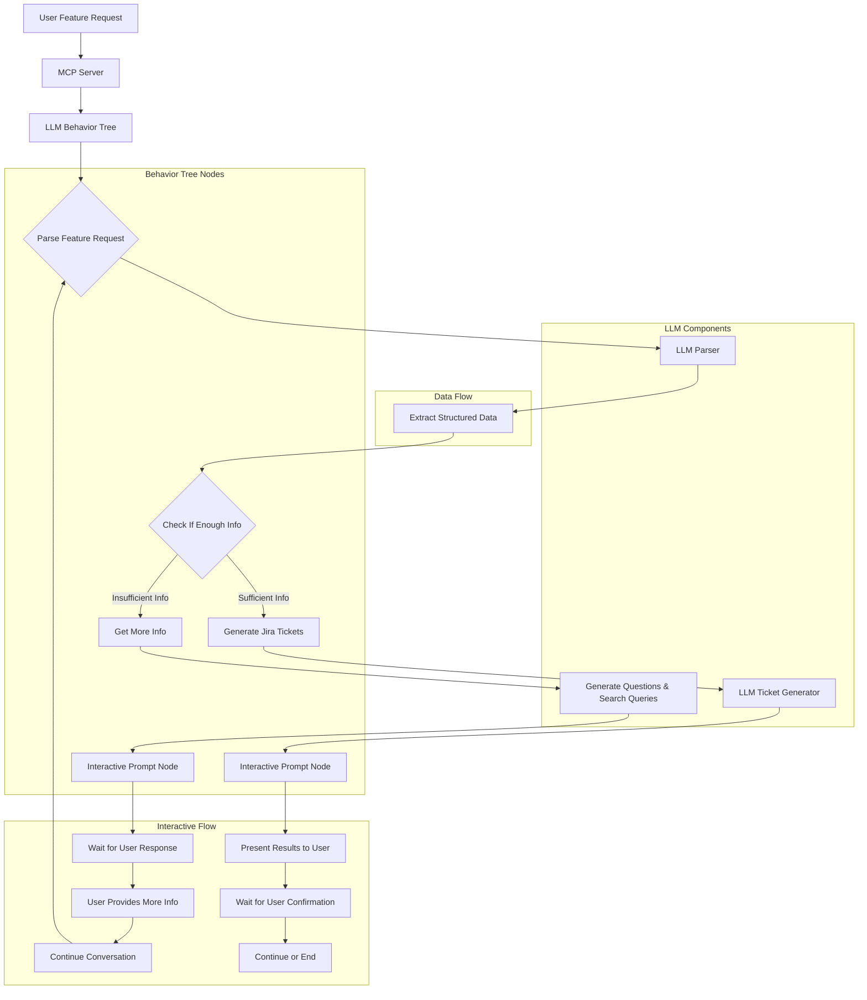

# ClaritaPM - LLM-Powered Project Management System

A conversational project management MCP (Model Context Protocol) server that uses LLM-powered behavior trees to generate Jira tickets through natural language conversations.

## System Overview

ClaritaPM combines the intelligence of local LLMs with structured behavior trees to provide a sophisticated conversational interface for project management. You can describe feature requests in natural language, and the system will use LLM decision-making to ask clarifying questions and generate comprehensive Jira tickets.

## System Architecture & Flow



## Core Components

### 1. MCP Server (`main.py`)
- **Purpose**: Handles Model Context Protocol communication
- **Functions**: 
  - Tool discovery and execution
  - Session management
  - Request/response handling
- **Key Tools**:
  - `analyze_feature_request`: Main analysis tool
  - `explore_feature_requirements`: Deep requirements analysis
  - `plan_feature_implementation`: Implementation planning
  - `clarita_pm_health_check`: System health monitoring
  - `continue_conversation`: Handle user responses and continue processing
  - `get_session_info`: Retrieve session information and status

### 2. LLM Behavior Tree (`llm_behavior_tree.py`)
- **Purpose**: Orchestrates intelligent decision-making workflow
- **Architecture**: Uses py_trees for structured behavior execution
- **Key Nodes**:
  - `ParseFeatureRequestNode`: Extracts structured information
  - `CheckIfEnoughInfoNode`: Determines if enough info is available
  - `GetMoreInfoNode`: Creates questions and search queries
  - `GenerateTicketsNode`: Creates comprehensive Jira tickets
  - `InteractivePromptNode`: Handles user interaction and response waiting

### 3. LLM Parser (`llm_parser.py`)
- **Purpose**: Handles LLM communication and response parsing
- **Capabilities**:
  - Local LLM support (LM Studio, Ollama)
  - OpenAI API support
  - Structured JSON output parsing
  - Fallback regex parsing
- **Key Functions**:
  - `parse_with_llm`: Feature request parsing
  - `parse_validation_with_llm`: Request validation
  - `parse_text_with_llm`: Free-form text generation

## System Flow Detailed

### Phase 1: Request Parsing
```
User Input → MCP Server → Behavior Tree → LLM Parser
```

1. **User submits feature request** via MCP protocol
2. **MCP Server** receives request and routes to behavior tree
3. **ParseFeatureRequestNode** uses LLM to extract structured data:
   - `target_page`: Which page the feature should be added to
   - `feature_type`: What type of feature (button, form, etc.)
   - `action`: What should happen when the feature is used

### Phase 2: Check If Enough Info
```
Parsed Data → CheckIfEnoughInfoNode → Decision Point
```

1. **CheckIfEnoughInfoNode** uses LLM to determine if enough information is available
2. **Decision Point**: 
   - If insufficient info → Get More Info Path
   - If sufficient info → Generate Tickets Path

### Phase 3A: Get More Info Path (Insufficient Info)
```
Check Failure → GetMoreInfoNode → InteractivePromptNode → Wait for Response
```

1. **GetMoreInfoNode** uses LLM to create:
   - Specific questions for the user
   - Codebase search queries for the master system
2. **InteractivePromptNode** presents questions to user and waits for response
3. **Master system** prompts user with questions
4. **User provides response** via `continue_conversation` tool
5. **Process continues** with updated information

### Phase 3B: Generate Tickets Path (Sufficient Info)
```
Check Success → GenerateTicketsNode → InteractivePromptNode → Present Results
```

1. **GenerateTicketsNode**:
   - Creates parent story with high-level description
   - Generates subtasks for implementation details
   - Includes effort estimates and acceptance criteria
   - Identifies dependencies between tasks
2. **InteractivePromptNode** presents results to user and waits for confirmation
3. **User can continue** with implementation planning or end the session

## LLM Integration

### Local LLM Support
- **LM Studio**: Default local LLM server
- **Ollama**: Alternative local LLM option
- **Configuration**: Environment variables for API base, model, and key

### OpenAI Support
- **Fallback option**: When local LLM unavailable
- **Configuration**: OpenAI API key required
- **Model**: GPT-3.5-turbo for cost efficiency

### Structured Output
- **Pydantic Models**: Ensure consistent JSON responses
- **Error Handling**: Fallback to regex parsing if LLM fails
- **Validation**: Type checking and response validation

## Behavior Tree Structure

```
SimpleProjectManagerRoot (Sequence)
├── ParseFeatureRequestNode
├── CheckIfEnoughInfoNode
└── InfoDecision (SimpleSelector)
    ├── GetMoreInformation (Sequence)
    │   ├── GetMoreInfoNode
    │   └── InteractivePromptNode
    └── GenerateTickets (Sequence)
        ├── GenerateTicketsNode
        └── InteractivePromptNode
```

## Installation & Setup

### 1. Clone Repository
```bash
git clone <repository-url>
cd ClaritaPM
```

### 2. Install Dependencies
```bash
pip install -r requirements.txt
```

### 3. Configure LLM
```bash
# Local LLM (LM Studio)
export LLM_API_BASE="http://127.0.0.1:1234/v1"
export LLM_MODEL="devstral-small-2505"
export LLM_API_KEY="lm-studio"

# Or OpenAI
export USE_OPENAI="true"
export OPENAI_API_KEY="your-openai-api-key"
```

### 4. Start Server
```bash
python main.py
```

## Usage Examples

### Interactive Feature Request Flow
```
User: "Add a save button to the dashboard"
System: "I need some clarification to create comprehensive Jira tickets:

**Questions for you:**
1. Could you please provide more details about your feature request?

**What I understand so far:**
- Target page: dashboard
- Feature type: button
- Action: save

**Please provide the missing information so I can continue.**"

User: "The save button should save the current dashboard state to the user's account. It should be placed in the top-right corner of the dashboard and show a loading state while saving."

System: "✅ Thank you for the clarification! I've successfully generated comprehensive Jira tickets.

🎫 **Generated Jira Tickets (4 total):**

**Parent Story 1:**
- Title: Implement Button on Dashboard Page
- Description: As a user, I want to save button on the dashboard page so that I can interact with the system effectively.
- System Impact: Dashboard page, button functionality
- Estimate: Medium (5 story points)
- Priority: Medium

**Subtasks:**
1. **Create Button Component for Dashboard**
   - Parent: Implement Button on Dashboard Page
   - Description: Implement the button component on the dashboard page with proper styling and functionality.
   - Estimate: Small (3 story points)
   - Priority: Medium
   - Acceptance Criteria:
     • Button component renders correctly
     • Component responds to user interactions
     • Proper error handling implemented

2. **Implement Save API Endpoint**
   - Description: Create backend API endpoint to handle save operations for button.
   - Estimate: Medium (5 story points)
   - Priority: Medium
   - Acceptance Criteria:
     • API endpoint accepts save requests
     • Proper validation and error responses
     • Data persistence working correctly

3. **Test Button Implementation**
   - Description: Create comprehensive tests for the button feature on dashboard page.
   - Estimate: Small (2 story points)
   - Priority: Medium
   - Acceptance Criteria:
     • All unit tests pass
     • Integration tests cover main flows
     • E2E tests validate user journey

**Would you like me to continue with implementation planning or explore other aspects?**"
```

### Session Management
```
User: "Check session status"
System: "📋 **Session Information**

**Session ID:** test-session-1
**Created:** 2025-07-28T00:45:12.123456
**Is Complete:** ❌ No
**Messages:** 3
**Waiting for Input:** ✅ Yes

**Feature Information:**
- target_page: dashboard
- feature_type: button
- action: save

**Conversation History:**
1. [user] Add a save button to the dashboard
2. [assistant] I need some clarification...
3. [user] The save button should save the current dashboard state...
```

## Key Features

- **Intelligent Parsing**: LLM understands context and nuance in natural language
- **Interactive Conversations**: Real-time user interaction with prompts and responses
- **Adaptive Questions**: Dynamic question generation based on missing information
- **Smart Information Gathering**: LLM-driven questions and codebase search queries
- **Comprehensive Output**: Detailed tickets with effort estimates, dependencies, and acceptance criteria
- **Session Management**: Maintains conversation state across multiple interactions
- **Detailed Logging**: Comprehensive logging of ticket generation process and system behavior
- **MCP Protocol**: Compatible with Cursor and other MCP clients
- **Fallback Mechanisms**: Robust error handling with regex parsing fallback

## Error Handling & Resilience

### LLM Failures
- **Primary**: Local LLM (LM Studio/Ollama)
- **Fallback**: OpenAI API
- **Final Fallback**: Regex-based parsing

### Behavior Tree Failures
- **Node-level error handling**: Each node catches and logs errors
- **Graceful degradation**: System continues with available information
- **Status tracking**: Clear success/failure status for each node
- **Interactive recovery**: System can wait for user input when errors occur

### Session Management
- **Persistent sessions**: Maintain conversation state
- **Error recovery**: Sessions can be resumed after errors
- **Timeout handling**: Automatic session cleanup
- **Interactive state**: Track waiting for user input status

### Logging & Debugging
- **Comprehensive logging**: Detailed logs of ticket generation process
- **Step-by-step tracking**: Log each ticket creation with details
- **Error context**: Rich error information for debugging
- **Performance monitoring**: Track execution time and success rates

## Performance Considerations

- **LLM Response Time**: Local LLMs typically 1-5 seconds
- **Behavior Tree Execution**: Usually completes in 10-30 seconds
- **Interactive Response Time**: Immediate prompts, user response time varies
- **Memory Usage**: Minimal, primarily session storage
- **Scalability**: Stateless design allows multiple concurrent sessions
- **Logging Overhead**: Minimal impact, structured logging for debugging

## Logging & Monitoring

### Ticket Generation Logging
The system provides comprehensive logging of the ticket generation process:

```
2025-07-28 00:55:34,593 - INFO - Generating fallback tickets
2025-07-28 00:55:34,594 - INFO - Creating tickets for: button on dashboard page with action: save
2025-07-28 00:55:34,594 - INFO - Created parent story: Implement Button on Dashboard Page
2025-07-28 00:55:34,594 - INFO - Created frontend subtask: Create Button Component for Dashboard
2025-07-28 00:55:34,594 - INFO - Created backend subtask: Implement Save API Endpoint (action: save)
2025-07-28 00:55:34,594 - INFO - Created testing subtask: Test Button Implementation
2025-07-28 00:55:34,594 - INFO - Generated 4 fallback tickets
2025-07-28 00:55:34,594 - INFO - Generated 4 tickets for feature request: Add a save button to the dashboard
```

### Logging Features
- **Step-by-step tracking**: Each ticket creation is logged with details
- **Action detection**: Logs when specific actions trigger additional tickets (e.g., save → API endpoint)
- **Ticket details**: Logs title, type, description, estimates, and acceptance criteria
- **Error context**: Rich error information for debugging
- **Performance metrics**: Track execution time and success rates

### Debugging with Logs
The logging system helps developers understand:
- How the LLM parsed the feature request
- Which execution path was taken
- What tickets were generated and why
- Any errors or fallbacks that occurred
- Performance bottlenecks in the system